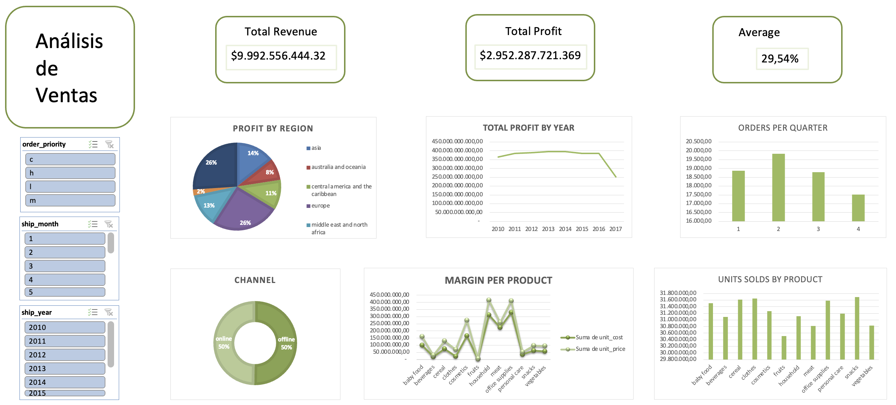

# Proyecto_final2
🏦 EDA Ventas

📘 Descripción del proyecto

El presente proyecto tiene como objetivo aplicar los conocimientos adquiridos durante el curso de Data & Analytics en el análisis exploratorio de datos (EDA) y la creación de un dashboard operativo que aporte valor a la toma de decisiones comerciales.
Para ello, se ha trabajado con dos conjuntos de datos de ventas procedentes de diferentes fuentes:
- Sales Records.xlsx – contiene información detallada de transacciones de ventas, incluyendo datos de país, categoría de producto, unidades vendidas, precios y beneficios.
- Online Retail.xlsx – dataset con información de facturas y cliente.

Tras un proceso de limpieza, transformación y unificación de ambas fuentes, se obtuvo un conjunto final con más de 50.000 registros y 20 columnas, preparado para el análisis descriptivo y estadístico.

🎯 Objetivos del análisis

El proyecto busca identificar patrones de comportamiento en las ventas y el rendimiento comercial a lo largo del tiempo, con un enfoque en la rentabilidad y la estacionalidad.
En concreto, los objetivos principales son:
- 1. Unificar y limpiar los datos de las dos fuentes iniciales, asegurando coherencia en nombres, tipos de datos y formatos de fecha.
- 2. Realizar un análisis exploratorio de datos (EDA) que permita entender la distribución, correlaciones y valores atípicos.
- 3. Analizar el desempeño comercial mediante indicadores clave (KPIs), tales como:
      - Beneficio total y por año.
      - Número de facturas y pedidos por trimestre.
      - Ingresos medios por cliente.
      - Rentabilidad por producto o país.
- 4. Detectar patrones estacionales, observando en qué periodos se concentra la mayor cantidad de ventas.
- 5. Diseñar un dashboard interactivo en Excel que permita visualizar de forma dinámica la evolución de las ventas, el beneficio y otros indicadores relevantes.

📊 Descripción del conjunto de datos

El dataset contiene información sobre ventas de un comercio. Está compuesto por 16 columnas distribuidas en dos archivos principales.

🧩 Primer dataset: Datos de la factura y cliente.

- invoice_no: Número de factura o transacción. 
- customer_id: Código único del cliente que realizó la compra.

👥 Segundo dataset: Datos de las ventas

- region: Región geográfica de la venta.
- country: País donde se realizó la venta.
- item type: Tipo de producto
- sales channel: Canal de venta.
- order priority: Prioridad del pedido.
- order date: Fecha en la que se realizó el pedido.
- order id: Id del pedido.
- ship date: Fecha venta.
- units sold: Unidades vendidas.
- unit price: Precio unitario del producto.
- unit cost: Coste unitario del producto.
- total revenue: Total ingreso.
- total cost: Total coste.
- total profit: Beneficio total.

⚙️ Instalación y configuración 

El proyecto se ha desarrollado en Python utilizando Pandas, NumPy, Matplotlib, Seaborn y Jupyter Notebook, dentro de Visual Studio Code.

🔧 Pasos para la instalación

  1. Clonar el repositorio
  git clone 
  cd Proyecto_final
  2. Crear un entorno virtual
  python3 -m venv venv2
  source venv2/bin/activate   # En Mac/Linux
  venv2\Scripts\activate      # En Windows
  3. Instalar dependencias
  pip install -r requirements.txt
  4. Abrir el proyecto en Visual Studio Code y ejecutar los notebooks dentro de la carpeta Jupyters.

🧹 Proceso de limpieza y transformación Durante la etapa de preparación de los datos realicé las siguientes tareas:

Estandaricé nombres de columnas (minúsculas, sin espacios ni puntos).
Corregí formatos numéricos y de fechas.
Creé nuevas variables derivadas de la fecha (year, month, day, quarter).
Identifiqué y traté valores nulos y outliers.
Documenté todas las funciones de limpieza en el archivo sp_limpieza.py dentro de la carpeta SRC.

📁 Archivos generados: 
- datos.xlsx
- datos_limpios.xlsx
- datos_finales.xlsx

📈 Análisis exploratorio (EDA) Dividí el análisis en dos grandes bloques:

1️⃣ Columnas categóricas

Detecté que no existía una categoría predominante en ninguna variable.
No había nulos.
Creé visualizaciones de distribución mediante Seaborn y Matplotlib.
Guardé las funciones en sp_eda.py y sp_visualizacion.py.

2️⃣ Columnas numéricas

Identifiqué outliers en variables como total_revenue, total_cost, total_profit.
No pude tratar los outliers porque en todos los casos eran superiores al 50%.
Los nulos los cambié por "unknown".

📊 Métricas de marketing calculadas

Calculé métricas clave para evaluar las ventas:

- KPIs de columnas categóricas.
- KPIS de collumnas numéricas.
- KPIs de clientes y pedidos.
- KPIS de fechas.
- ÑPIS combinados.

📊 Dashboard


<div style="text-align: center;">
   
   </div>


🧭 Conclusiones 

- 1. Europa es la región más rentable, concentrando aproximadamente el 26 % del beneficio total, seguida por Asia y Oriente Medio. Esto sugiere una fuerte presencia comercial en mercados maduros, mientras que Oceanía y Centroamérica representan oportunidades de crecimiento con menor rentabilidad actual.
- 2. El beneficio total muestra una ligera caída a partir de 2016, tras varios años de estabilidad. Este descenso podría estar relacionado con un aumento de los costes, cambios en la demanda o menor margen en determinados productos, lo que sugiere revisar la estrategia de precios o distribución.
- 3. El segundo trimestre (Q2) registra el mayor número de pedidos, con más de 19.000 facturas, lo que evidencia una estacionalidad positiva en las ventas durante ese periodo. En contraste, el cuarto trimestre presenta menor actividad, por lo que podría reforzarse la estrategia comercial en esa fase del año.
- 4. El canal de venta online y offline mantiene un equilibrio del 50 % cada uno, indicando una correcta diversificación comercial. No obstante, el análisis del margen por producto revela variabilidad significativa — especialmente en categorías como household y office supplies, que destacan por su rentabilidad —, lo que permite enfocar esfuerzos en productos de mayor margen.

💻 Tecnologías utilizadas

Python
Pandas
NumPy
Matplotlib
Seaborn
Jupyter Notebook
Visual Studio Code
Excel

🧩 Estructura del repositorio

```bash
PROYECTO_FINAL/
│
├── Data/
│   ├── datos_finales.xlsx
│   ├── datos_limpios.xlsx
│   ├── datos.xlsx
│   └── Online retail.xlsx
│   └── Sales Recors.xlsx
│
├── Jupyters/
│   ├── eda_preliminar.ipynb
│   ├── limpieza.ipynb
│   ├── columnas_categoricas.ipynb
│   └── columnas_numericas.ipynb
│   └── merketing.ipynb
│
├── SRC/
│   ├── sp_limpieza.py
│   ├── sp_eda.py
│   ├── sp_visualizacion.py
│   └── sp_nulos_num.py
│
├── requirements.txt
└── README.md
```
✍️ Autor
 Aïna [GitHub Profile](https://github.com/Ainamg)
